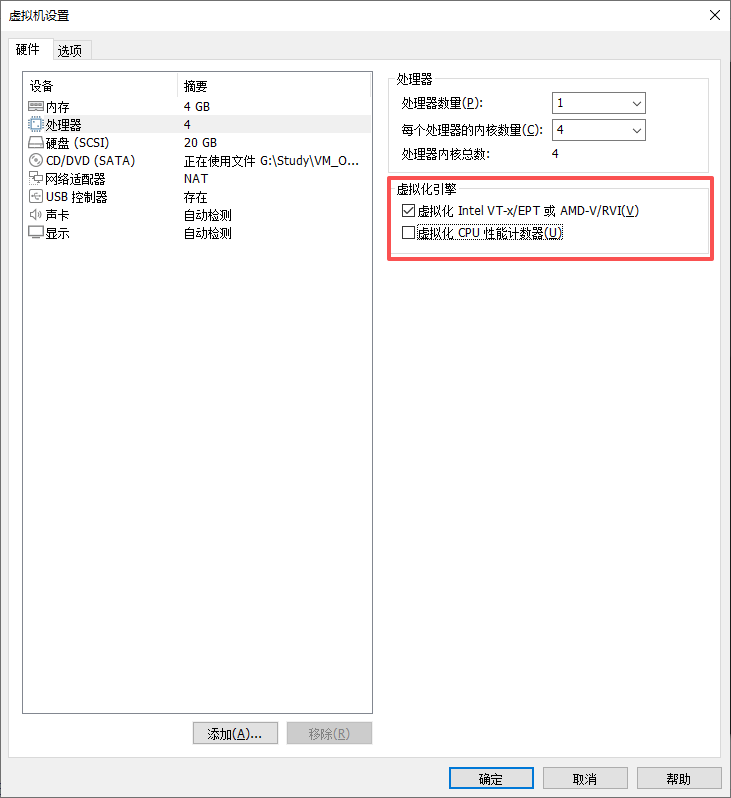
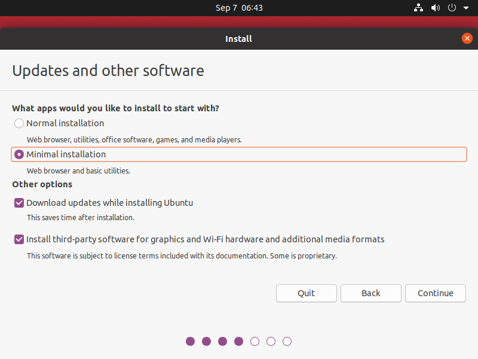
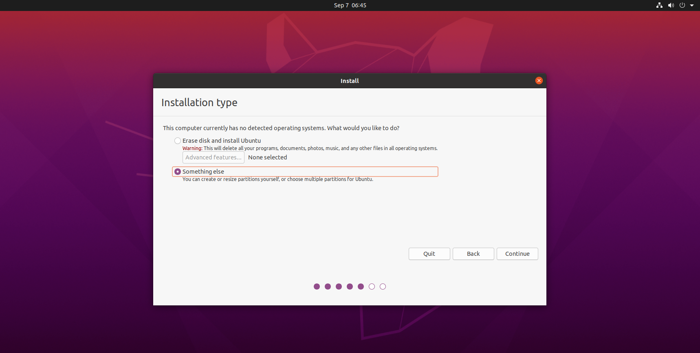
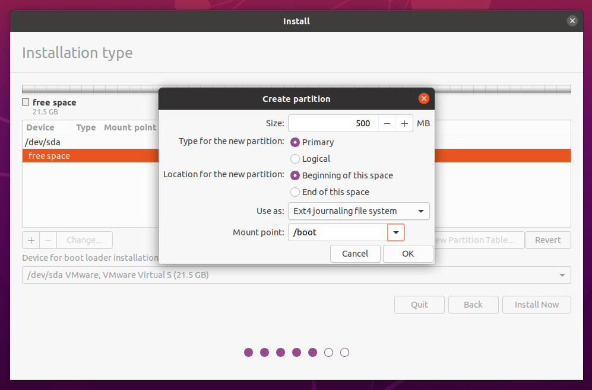

下载Ubuntu

https://ubuntu.com/download/desktop

## 新建虚拟机

1. 打开安装好的虚拟机，创建新的虚拟机

2. 选择自定义安装，之后进行下一步

3. 安装来源选择 稍后安装操作系统

4. 配置处理器及内存，然后进行下一步

5. 磁盘选择 创建新虚拟磁盘，并将虚拟磁盘存储为单个文件

## 配置虚拟机

1. 打开虚拟机设置，设置安装镜像文件的位置（就是之前下载好的Ubuntu光盘映像文件）

