# NC65 Rest接口开发及调试

## 接口注册方法

在模块的META-INF文件夹下，增加.rest扩展名的接口文件，内容为xml格式，参考脚本如下：

```xml
<?xml version="1.0" encoding='gb2312'?>
<module>
    <!-- 委外支付单推单-->
    <rest>
        <resource classname="nccloud.api.cmp.pub.add.PayBillAddForOtherSystemResource" exinfo=""/>
    </rest>
    <!-- 第二个接口-->
</module>
```

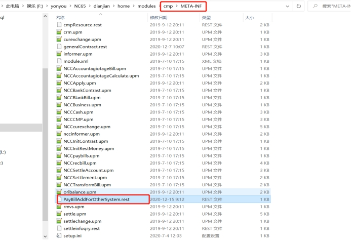 

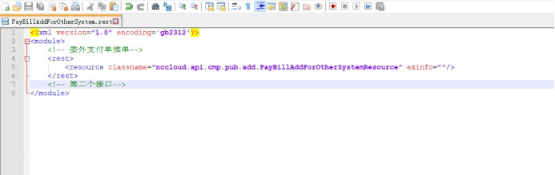 

 

## 服务代码编写

1. 新建工程（uap业务组件项目）

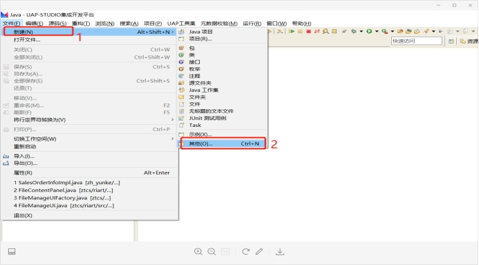 

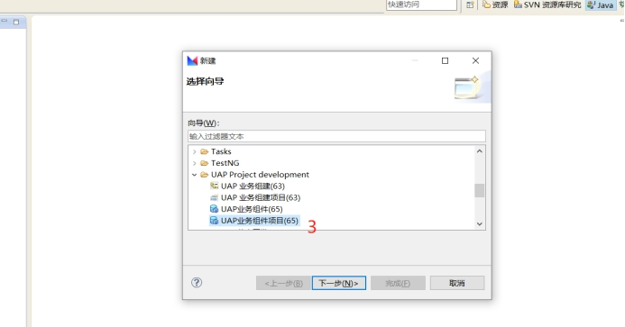 

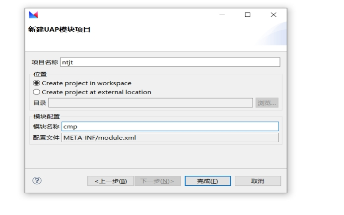 


2. 右键项目->新建->其他->uap业务组件

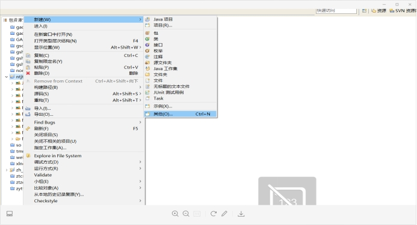 

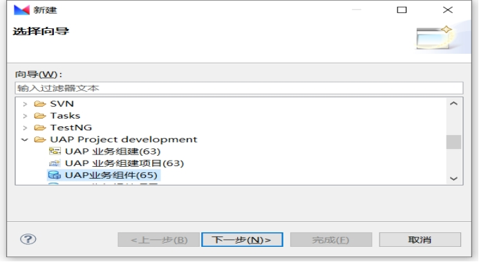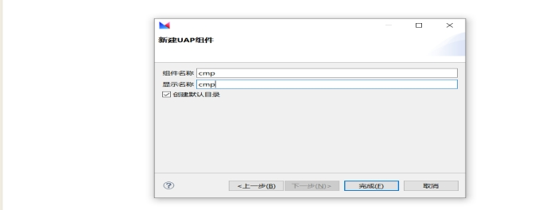 

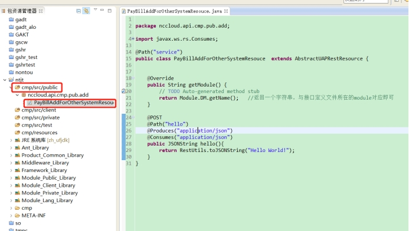 


3. 注册文件中的nccloud.api.cmp.pub.add.PayBillAddForOtherSystemResource需要放在开发环境的public源码目录下，继承uap.ws.rest.resource.AbstractUAPRestResource，参考脚本如下

 ```java
 package nccloud.api.cmp.pub.add;
 
 import javax.ws.rs.Consumes;
 import javax.ws.rs.POST;
 import javax.ws.rs.Path;
 import javax.ws.rs.Produces;
 import org.json.JSONString;
 import nc.vo.scmpub.api.rest.utils.RestUtils;
 import nc.vo.scmpub.res.Module;
 import uap.ws.rest.resource.AbstractUAPRestResource;
 
 @Path("service")
 public class PayBillAddForOtherSystemResouce extends AbstractUAPRestResource {
     
     @Override
     public String getModule() {
         // TODO Auto-generated method stub
         return Module.DM.getName();  //返回一个字符串，与接口定义文件所在的module对应即可
     }
 
     @POST
     @Path("hello")
     @Produces("application/json")
     @Consumes("application/json")
     public JSONString hello(){
         return RestUtils.toJSONString("Hello World!");
     }
 }
 ```


## 部署和测试

1. 将上面的代码部署到相应模块后，重启中间件，部署路径如下：home>bin>sysConfig.bat

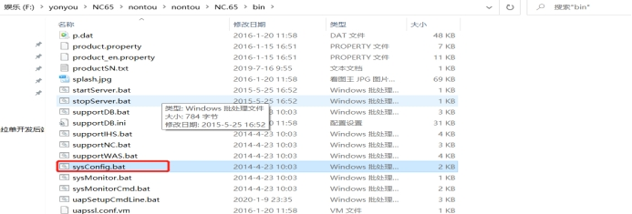 

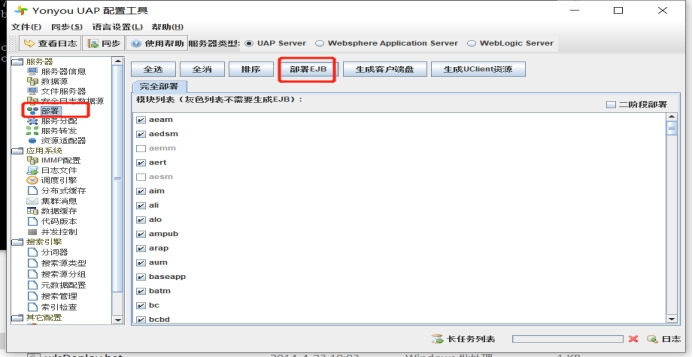 


2. Postman测试时，测试URL设置为：http://ip:port/uapws/rest/service/hello，其中service/hello为代码中的类声明中的Path和方法中的Path，uapws/rest/为固定的NC65中的REST服务访问路径。Postman中设置请求方式为“POST”，请求HEAD参数Content-Type为application/json即可。效果如下：

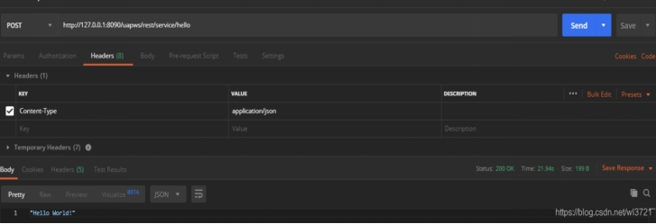

## 备注

本地调试需配置Debug参数，如下图所示

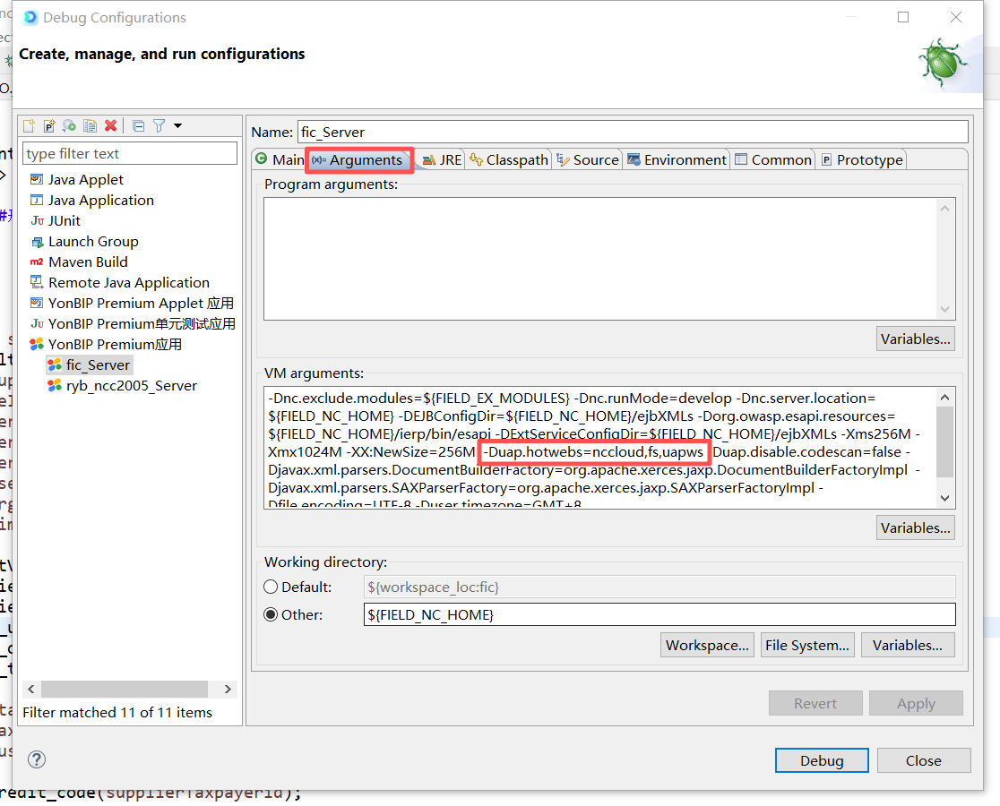