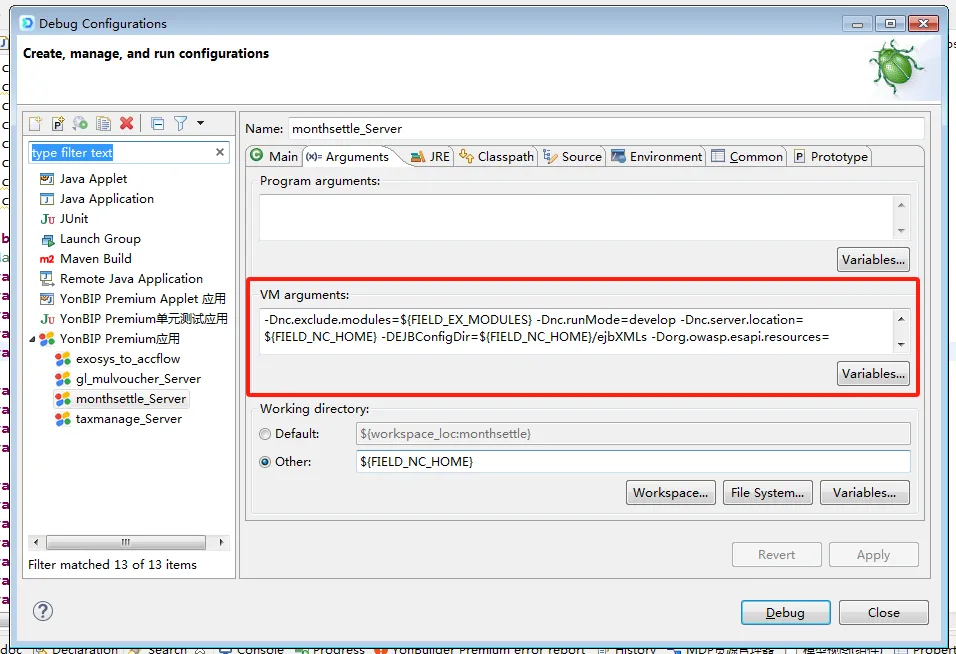
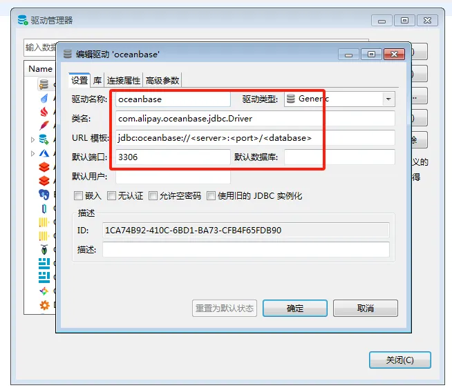

# 前端

1. 下载前端脚手架，替换config.js


2. 下载前端项目，清空脚手架的src文件夹，并将前端项目放入src


3. 目录结构如下


4. 启动：npm run dev

5. 补丁：npm run patch

# 后端

## Ecplise配置

1. 配置HOME及数据库：window→preferences


2. 替换home中的prop.xml


3. 拉取项目代码


4. 调试配置




- VM arguments：

``` 
-Dnc.exclude.modules=${FIELD_EX_MODULES} 
-Dnc.runMode=develop -Dnc.server.location=${FIELD_NC_HOME} 
-DEJBConfigDir=${FIELD_NC_HOME}/ejbXMLs 
-Dorg.owasp.esapi.resources=${FIELD_NC_HOME}/ierp/bin/esapi 
-DExtServiceConfigDir=${FIELD_NC_HOME}/ejbXMLs 
-Xms256M 
-Xmx6144M 
-XX:NewSize=256M 
-Duap.hotwebs=nccloud,fs,yonbip,uapws 
-Duap.disable.codescan=false 
-Djavax.xml.parsers.DocumentBuilderFactory=com.sun.org.apache.xerces.internal.jaxp.DocumentBuilderFactoryImpl 
-Djavax.xml.parsers.SAXParserFactory=com.sun.org.apache.xerces.internal.jaxp.SAXParserFactoryImpl 
-Dfile.encoding=UTF-8 
-Duser.timezone=GMT+8 -Duap.hotwebs=nccloud,fs,uapws
```

# 数据库

## 数据库配置

1. 数据库→新建数据库连接



## 驱动配置

- 数据库→驱动管理器→新建


