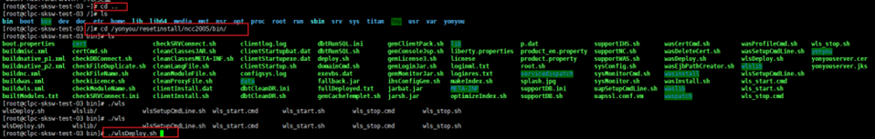
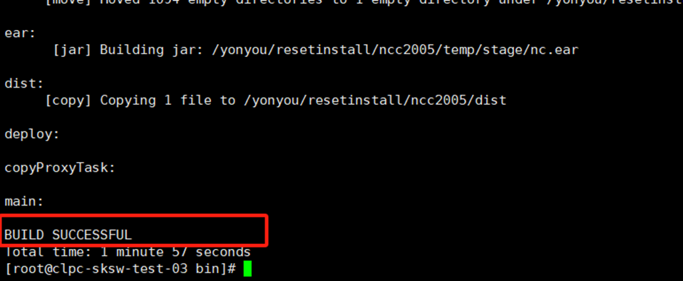
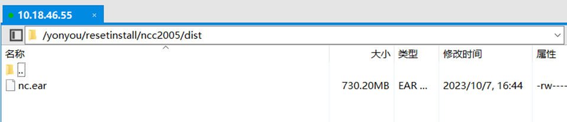
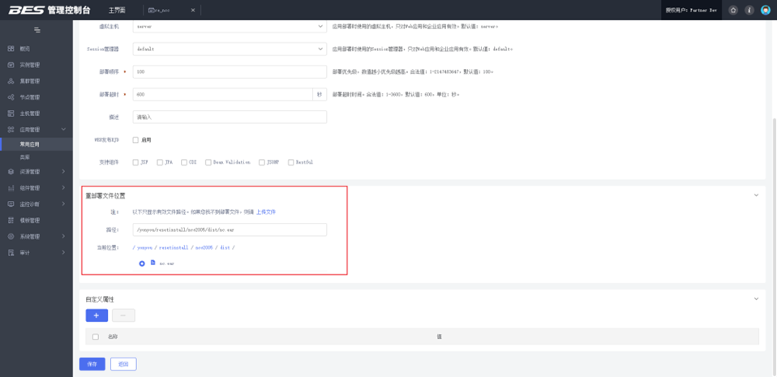
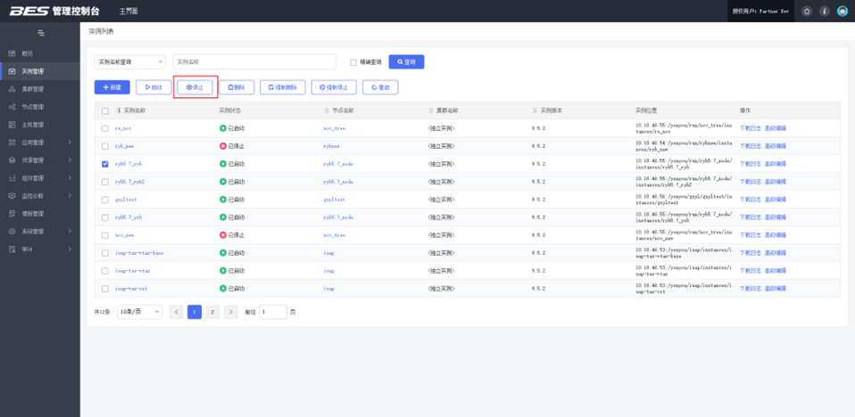
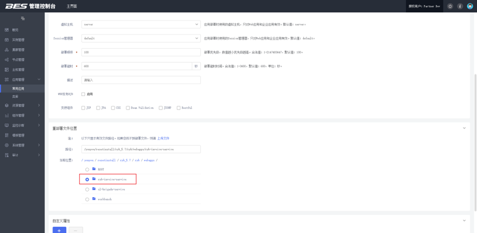
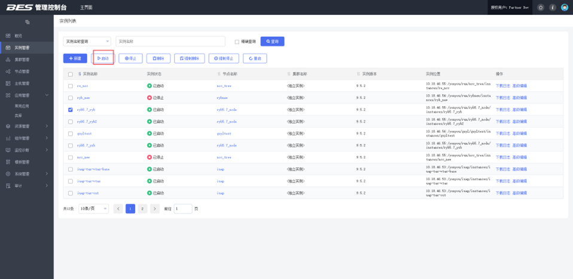

## 远程桌面

账号：ganxianjun  密码：L0gin_PassW0rd_$

账号：Administrator  密码：L0gin_PassW0rd_$

# 测试补丁步骤

## NCC

### 操作

1. 将补丁内容放到 `$HOME$` 对应的路径（e.g: `/yonyou/resetinstall/ncc2005` ）

2. 在 `$HOME$/bin `目录下运行 `./wlsDeploy.sh` 生成 `.ear` 文件，终端出现 `BUILD SUCCESSFUL` 表示生成成功（在 `$HOME$/dist` 目录检查 `.ear` 文件是否生成及生成时间）

   

   

   

3. 宝蓝德:停服务 --> 重新部署 --> 启服务

   - 停服务（实例管理）：勾选要停止的实例，点击停止

     

   - 重新部署（应用管理-常用应用）：点击重新部署，选择生成的.ear文件并保存，部署成功后再重启实例

     

     

   - 启服务（实例管理）：勾选要启动的实例，点击启动

     

### 过程中需要检查的地方

#### 部署前

1. 检查`$HOME$/dist` 目录是否生成 `.ear` 文件和生成时间

#### 部署后/重启前

1. 检查 `$实例$/deployments/__internal` 目录是否生成 `.ear` 文件和生成时间（`$实例$` 在服务器部署位置查看）

#### 可选项

1. 重启后查看 `$实例$/logs/server.log` 启动日志，命令：`tail -f server.log`
2. 查看 `$HOME$/nclogs/$实例名$/nc-log.log` 运行日志，命令：`tail -f nc-log.log`

## 融易报

### 操作

1. 将补丁内容放到 `$HOME$/webapps` 对应的路径（e.g: `/yonyou/resetinstall/ryb_5.7/ryb/webapps` ）

2. 宝蓝德:停服务 --> 重新部署 --> 启服务

   - 停服务（实例管理）：勾选要停止的实例，点击停止

   

   - 重新部署（应用管理-常用应用）：点击重新部署，选择`$HOME$/webapps/`对应文件夹并保存

   

   

   - 启服务（实例管理）：部署成功后再重启实例

   

### 过程中需要检查的地方

1. 重启后查看 `$实例$/logs/server.log` 启动日志，命令：`tail -f server.log`

# 生产补丁步骤

## 费控

相关地址：171/175/176

home路径 ：`/data/yonyou/install/ncc2005`

### 操作

#### 上传补丁

1. 覆盖补丁至`$home$`相关目录下
2. 删除 `$home$` 下文件
3. 在171服务器 `/data/yonyou/install/ncc2005/bin` 下执行 `./wslDeploy.sh`
4. 终端出现 `BUILD SUCCESSFUL` 表示生成成功，在 `home/dist` 目录检查`.ear`文件是否生成及生成时间

#### 停服务（宝蓝德）

1. 先停节点服务器，最后master服务器

#### 启服务（宝蓝德）

1. 先重新部署，然后启动master服务器，最后启动节点服务器

### 过程中需要检查

#### 部署前

1. 检查$HOME$/dist目录是否生成.ear文件（171）

#### 部署后/启动前

1. 检查三台子服务器(nccloud_1、nccloud_2、nccloud_3)，`$实例$/deployments/__internal` 目录是否生成 `.ear` 文件和生成时间（`$实例$` 在服务器部署位置查看）

   

#### 可选

1. 重启后--查看`$实例$/logs/server.log`启动日志，命令：`tail -f server.log`
2. 查看 `$HOME$/nclogs/$实例名$/nc-log.log`运行日志，命令：`tail -f nc-log.log`

# 相关路径

- 175/176（生产）的 `.ear` 文件路径：
  1. `/data/yonyou/node_ncc1/instances/ncc2005_1/deployments/__internal`

- 融易报（测试）补丁路径：

  1. `/yonyou/resetinstall/ryb_5.7/ryb/webapps/$模块名$`

  2. 重新部署时选择模块名并保存   

- 测试环境日志：
  1. 运行日志
     - `$HOME$/nclogs/$instance$/nc-log.log`
     - 例 `/yonyou/resetinstall/ncc2005/nclogs/re_ncc/nc-log.log`
  2. 启动日志
     - `/yonyou/run/ncc_tree/instances/re_ncc/logs`

## 虚列费用

相关地址：53/54

