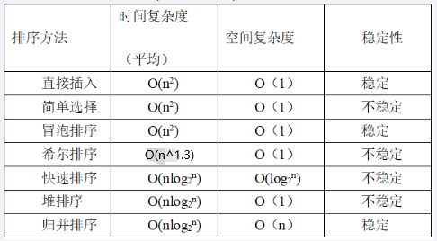

1. 系统总线：地址总线，数据总线，控制总线

2. 系统总线用于**主存与外设部件**连接

3. DMA控制器和终端CPU发出的数据地址是**主存物理地址**

4. 海明码校验公式：**2^k - 1 >= n + k**

5. 负数的补码真值需要计算，无法直观应对

6. OSI模型：**应（给用户用），表（翻译加密），会（建立连接），传（端到端可靠），网（寻址找路），链（成帧纠错），物（传 0 和 1）**

7. 浏览器和服务器之间用于加密HTTP消息的方式是**会话密钥+对称加密**

8. web应用防火墙无法有效防止流氓软件，因为其已经处于系统内部

9. 关键路径是指从开始节点到结束节点之间持续时间最长的路径

10. 沟通路径公式：n(n-1)/2

11. 计算位示图大小

    物理块个数 = 磁盘容量 / 物理块大小 (换算为同单位MB)

    位示图大小 = 物理块个数 / 字长 (不用管单位) 

12. 磁盘调度方法

    FCFS先来后到服务：按请求到达的先后顺序

    SSTF最短寻道时间优先：每次选离当前磁头最近的请求

    SCAN电梯算法：朝一个方向走，处理完再掉头返回

    C-SCAN循环扫描算法：只朝一个方向，到头直接返回起点，不返回

13. 同一进程下的各个线程之间共享代码、数据、进程空间、打开文件，但是栈指针不可共享

14. 敏捷开发中，并列争球法使用迭代的方法

15. 数据耦合：传递数据参数

    标记耦合：传递数据结构

​	控制耦合：传递控制变量、开关量，来控制对方内部逻辑

​	公共耦合：多个模块访问同一公共数据环境

​	内容耦合：直接访问另一个模块内部数据/代码

16. 实现可移植性必须要是要有”平台无关“和”通用“的特性

17. 路径覆盖 = 判断个数 x 2

18. McCabe = 封闭区域个数 + 1

19. 序列图：以时间顺序组织的对象之间的交互活动

    活动图：系统内从一个活动到另一个活动的流程

    对象图：某一时刻一组对象以及它们之间的关系

    用例图：显示一组用例、参与者一级它们之间的关系，用于展示系统具有的功能或提供的服务

20. 一个模型元素不能被一个以上的包所拥有

21. 原型模式属于创建型设计模式，用于创建对象

22. Python创建只包含一个元素的元组，后面的逗号不能省

23. Python中，x = tuple() 可以定义一个元组

24. Python中没有switch...case语句

25. 物理层、逻辑层、视图层，抽象层次逐渐升高

26. Armstrong公理

27. 关系模式

28. 授权语句：GRANT ... ON

29. 哈夫曼树，左子树为0，右子树为1，只能有0度或2度

30. 邻接表存储的广度优先遍历，时间复杂度为 **顶点数 + 边数**

31. Kruskai采用贪心算法

32. 森林转二叉树

33. 

34. Apache默认的Web目录为"/home/httpd"

35. SNMP使用的传输层协议是UDP

36. 